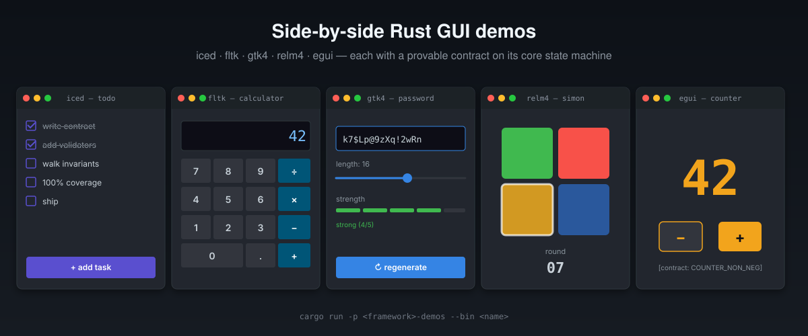

# rust-gui-from-zero

[](https://github.com/paiml/rust-gui-from-zero/actions/workflows/ci.yml)
[](https://opensource.org/licenses/MIT)
[](https://www.rust-lang.org)
[](#quality-gates)



Side-by-side Rust GUI demos across **iced**, **fltk**, **gtk4**, **relm4**,
and **egui** — each with a provable contract on its core state machine,
100% line-and-function coverage on its logic crate, and a strict
`-D warnings` clippy gate.

## Install

Requires Rust 1.93+ and the system libraries for whichever GUI framework
you build:

| Framework | System packages (Debian/Ubuntu) |
|-----------|--------------------------------|
| gtk4 / relm4 | `libgtk-4-dev` |
| fltk | `libpango1.0-dev libx11-dev libxext-dev libxft-dev libxinerama-dev libxcursor-dev libxrender-dev libxfixes-dev libpng-dev libgl1-mesa-dev libglu1-mesa-dev` |
| iced / egui | nothing extra (winit + wgpu) |

```bash
git clone https://github.com/paiml/rust-gui-from-zero
cd rust-gui-from-zero
cargo build --workspace
```

## Usage

Each demo binary is in its own crate under `crates/<framework>-demos/src/bin/`:

```bash
# Egui — counter demo
cargo run -p egui-demos --bin egui-counter

# GTK4 — random password generator
cargo run -p gtk-demos --bin gtk-random-password-step4-strength

# Relm4 — full Simon-Says game
cargo run -p relm4-demos --bin relm4-simon-game

# Iced — todo list
cargo run -p iced-demos --bin iced-todo

# FLTK — calculator
cargo run -p fltk-demos --bin fltk-calculator
```

Run `cargo run -p <crate> --bin` with no name to see the binaries each
crate ships.

## Quality gates

```bash
cargo fmt --all -- --check
cargo clippy --workspace --all-targets --no-deps -- -D warnings
cargo test --workspace --all-targets

# 100% line + function coverage on logic crates (excludes src/bin/)
cargo llvm-cov --workspace --lib \
  --ignore-filename-regex '(src/bin/|target/)' \
  --fail-under-lines 100 --fail-under-functions 100

cargo deny check advisories licenses bans sources
```

CI runs all five on a self-hosted intel runner; the `gate` job aggregates
them via `needs:` so the GitHub `Green Main` ruleset can require a single
literal `gate` check.

## Layout

```
crates/
  contracts/      assert_invariant! macro, ContractError type
  iced-demos/     iced 0.10 demos
  fltk-demos/     fltk 1.4 demos
  gtk-demos/      gtk4 0.8 demos
  relm4-demos/    relm4 0.8 demos
  egui-demos/     eframe 0.22 demos
```

Each demo crate splits **logic** (pure state machines in `src/*.rs`,
fully tested, 100% line+function covered) from **view** (event-loop
bindings in `src/bin/*`, excluded from coverage).

## Contract pattern

Every binary embeds a `//! Provable contract: <NAME>` doc and runs
`assert_invariant!(NAME, check_*().is_ok())` at startup. See
`crates/relm4-demos/src/simon.rs` for the canonical example: pure state
machine, three `validate_*` helpers exposing post-state assertions, plus
a `check_simon_invariants()` walker that exercises the validators across
a deterministic 16-step game.

## License

MIT
